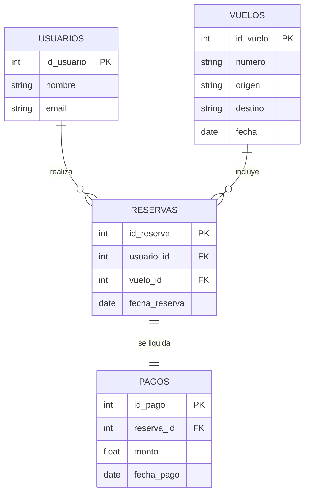

# Diagrama de Base de Datos

## Descripción de entidades

- **usuarios**: almacena la información de los clientes registrados.
- **vuelos**: contiene los detalles de los vuelos disponibles.
- **reservas**: vincula usuarios con vuelos y registra la fecha de reserva.
- **pagos**: guarda los registros de pago para cada reserva.

