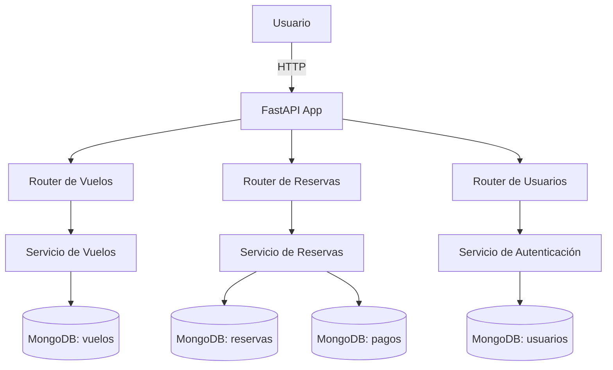

# Diagrama de Componentes

## Explicación de Componentes
- **FastAPI App**: núcleo monolítico que agrupa todos los módulos y expone la API.
- **Routers**: separan los endpoints por dominio (vuelos, reservas, usuarios) y delegan al servicio correspondiente.
- **Servicios**: aplican las reglas de negocio y coordinan operaciones entre repositorios.
- **MongoDB**: base de datos documental con colecciones para usuarios, vuelos, reservas y pagos.

Este diagrama muestra cómo las solicitudes del usuario recorren la aplicación monolítica hasta persistir o recuperar datos de MongoDB.
