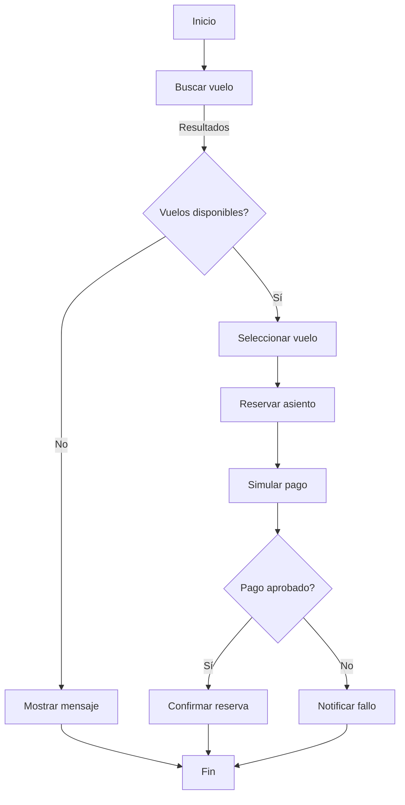
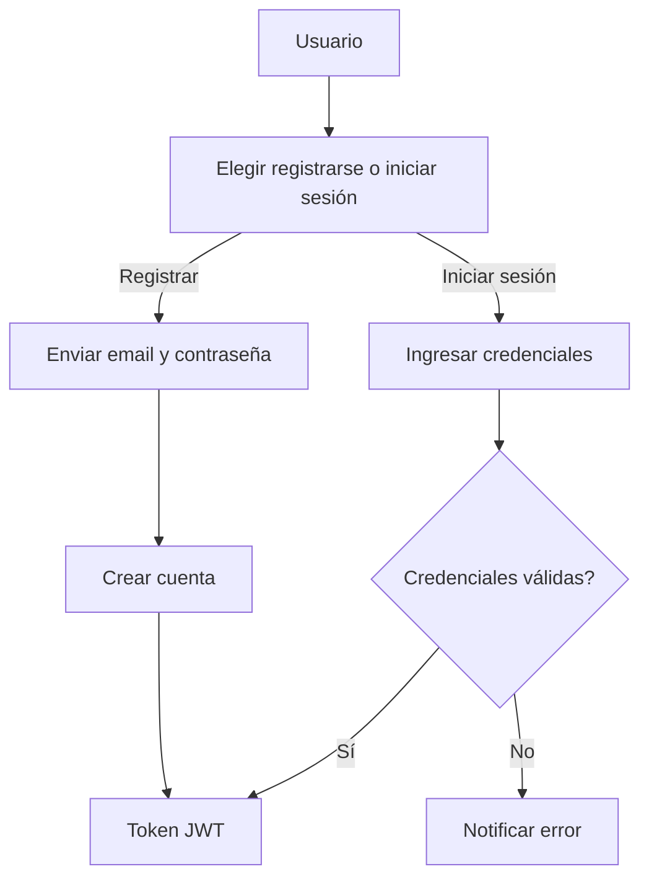
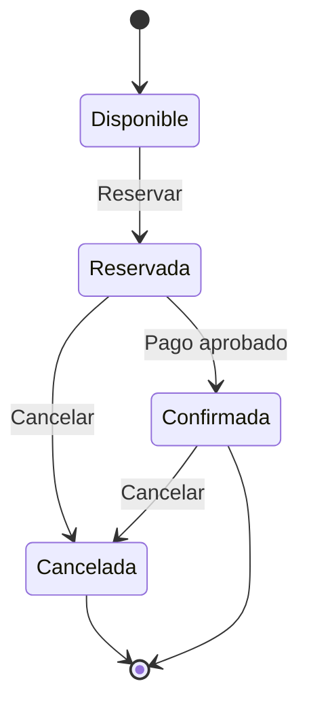

# Diagramas de Flujo

## Flujo de Búsqueda y Reserva de Vuelos

```mermaid
graph TD
    A[Inicio] --> B[Buscar vuelo]
    B -->|Resultados| C{Vuelos disponibles?}
    C -->|No| D[Mostrar mensaje]
    D --> E[Fin]
    C -->|Sí| F[Seleccionar vuelo]
    F --> G[Reservar asiento]
    G --> H[Simular pago]
    H --> I{Pago aprobado?}
    I -->|Sí| J[Confirmar reserva]
    J --> E
    I -->|No| K[Notificar fallo]
    K --> E
```

## Flujo de Registro e Inicio de Sesión

```mermaid
graph TD
    A[Usuario] --> B[Elegir registrarse o iniciar sesión]
    B -->|Registrar| C[Enviar email y contraseña]
    C --> D[Crear cuenta]
    D --> E[Token JWT]
    B -->|Iniciar sesión| F[Ingresar credenciales]
    F --> G{Credenciales válidas?}
    G -->|Sí| E
    G -->|No| H[Notificar error]
```

## Estados de una Reserva

```mermaid
stateDiagram-v2
    [*] --> Disponible
    Disponible --> Reservada: Reservar
    Reservada --> Cancelada: Cancelar
    Reservada --> Confirmada: Pago aprobado
    Confirmada --> Cancelada: Cancelar
    Cancelada --> [*]
    Confirmada --> [*]
```
