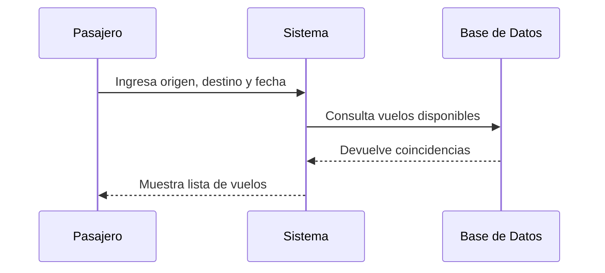
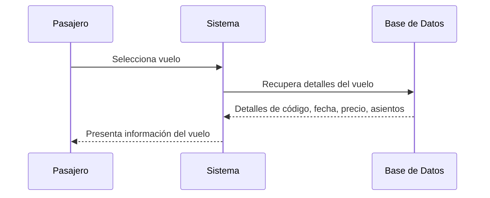
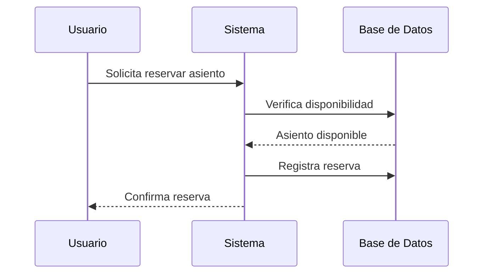
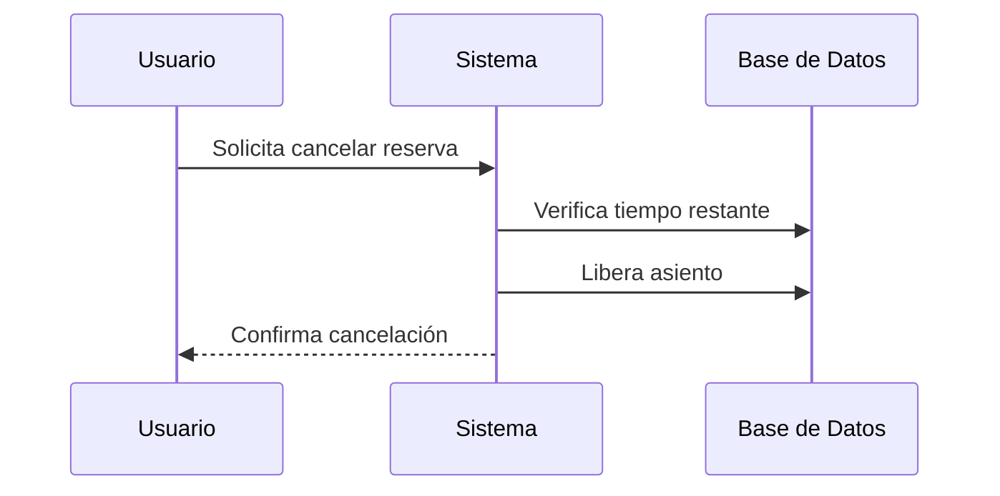
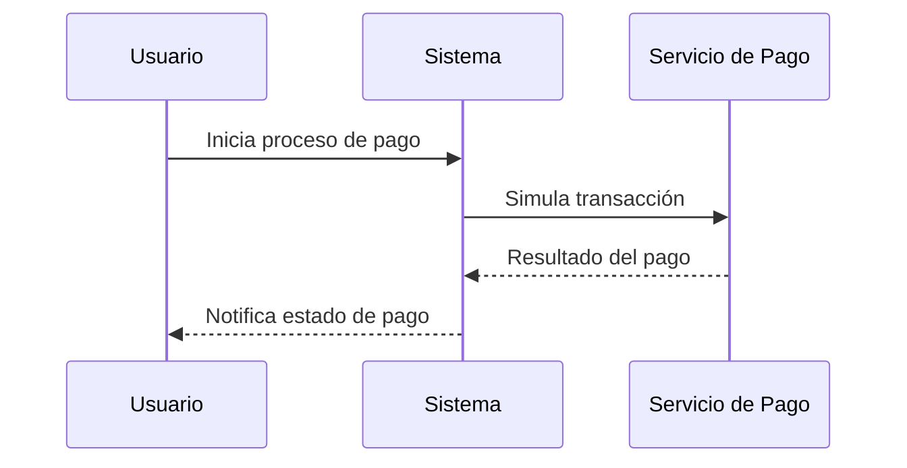
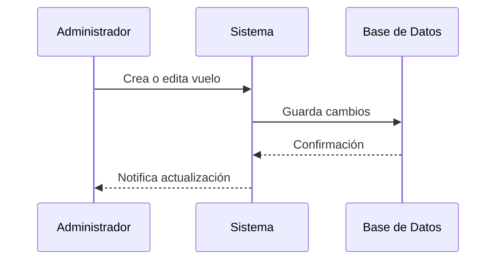
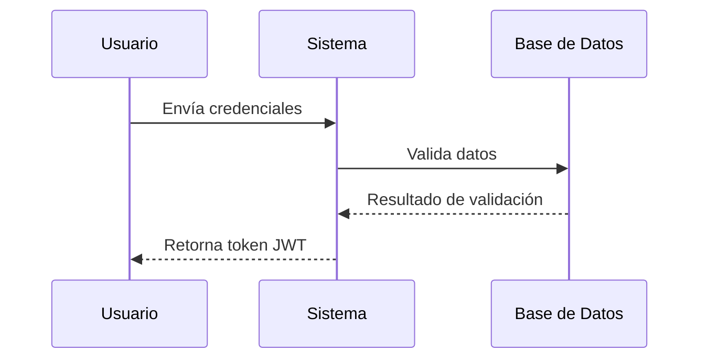
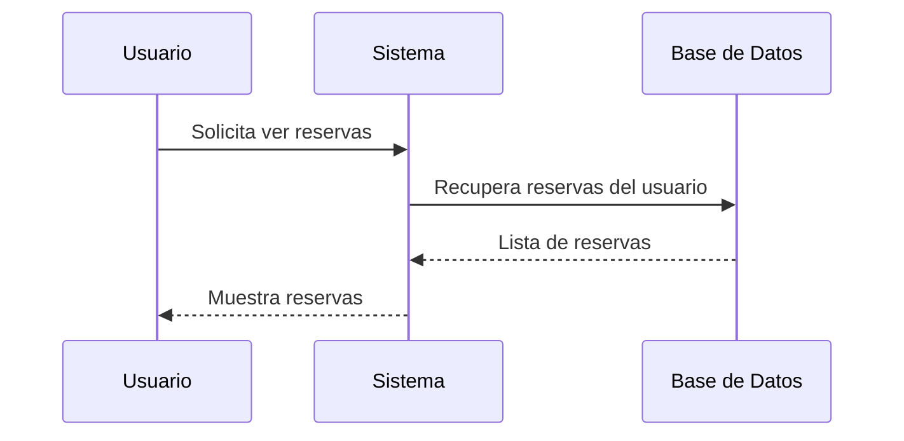

# Diagramas de Secuencia

Los siguientes diagramas describen el flujo de interacción entre los actores y el sistema para cada caso de uso.

## CU1. Búsqueda de vuelos

## CU2. Visualización de información de vuelo

## CU3. Reserva de asientos

## CU4. Cancelación de reservas

## CU5. Proceso de pago simulado

## CU6. Gestión de vuelos por administradores

## CU7. Registro e inicio de sesión

## CU8. Gestión de reservas

